# User Interface

# 1. Elemente generale

## 1.1. UIElement
Este clasa de baza pe care o mosteneste orice element de interfata.

**UIElement**
<table>
    <tr>
        <th>Denumire</th>
        <th>Tip</th>
        <th>Observatii</th>
        <th>Valoare implicita</th>
    </tr>
    <tr>
        <td>id</td>
        <td>id!</td>
        <td>Se atribuie automat.</td>
        <td>-</td>
    </tr>
    <tr>
        <td>hidden</td>
        <td>boolean!</td>
        <td>Ascunde/afiseaza elementul si elementele subordonate.</td>
        <td>false</td>
    </tr>
</table>

## 1.2. Sectiune
**Sectiune** mosteneste **UIElement**
<table>
    <tr>
        <th>Denumire</th>
        <th>Tip</th>
        <th>Observatii</th>
        <th>Valoare implicita</th>
    </tr>
</table>

## 1.3. Form
Clasa de baza pe care o mostenesc machetele.

**Form** mosteneste **UIElement**
<table>
    <tr>
        <th>Denumire</th>
        <th>Tip</th>
        <th>Observatii</th>
        <th>Valoare implicita</th>
    </tr>
    <tr>
        <td>disabled</td>
        <td>boolean!</td>
        <td>Daca valoarea este true, toate elementele subordonate vor fi disabled. Altfel se vor considera proprietatile disabled individuale componentelor</td>
        <td>false</td>
    </tr>
</table>

## 1.4. Control
Clasa de baza pe care o mostenesc controalele.

**Control** mosteneste **UIElement**
<table>
    <tr>
        <th>Denumire</th>
        <th>Tip</th>
        <th>Observatii</th>
        <th>Valoare implicita</th>
    </tr>
    <tr>
        <td>name</td>
        <td>text!</td>
        <td>Denumirea campului de date.</td>
        <td></td>
    </tr>
    <tr>
        <td>disabled</td>
        <td>boolean!</td>
        <td>Daca valoarea este true, elementul si elementele subordonate vor fi dezactivate.</td>
        <td>false</td>
    </tr>
</table>

## 1.5. FormControl
Clasa de baza pe care o mostenesc controalele din machete (Form-uri).

**FormControl** mosteneste **UIElement**
<table>
    <tr>
        <th>Denumire</th>
        <th>Tip</th>
        <th>Observatii</th>
        <th>Valoare implicita</th>
    </tr>
    <tr>
        <td>label</td>
        <td>text</td>
        <td>Eticheta afisata, daca este cazul.</td>
        <td>null</td>
    </tr>
    <tr>
        <td>required</td>
        <td>boolean!</td>
        <td>Daca valoarea este true, se va afisa o steluta rosie care indica obligativitatea completarii campului.</td>
        <td>false</td>
    </tr>
</table>

# 2. Controale

## 2.1. TextBox
Camp de baza de introducere de texte scurte.

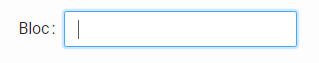

**TextBox** mosteneste **FormControl**
<table>
    <tr>
        <th>Denumire</th>
        <th>Tip</th>
        <th>Observatii</th>
        <th>Valoare implicita</th>
    </tr>
    <tr>
        <td>value</td>
        <td>text</td>
        <td>Valoarea afisata in camp.</td>
        <td></td>
    </tr>
    <tr>
        <td>maxLength</td>
        <td>intreg</td>
        <td>Lungimea maxima a textului introdus.</td>
        <td>null</td>
    </tr>
</table>

## 2.2. LargeTextBox
Camp de baza de introducere de texte mari, care se pot intinde pe mai multe randuri.

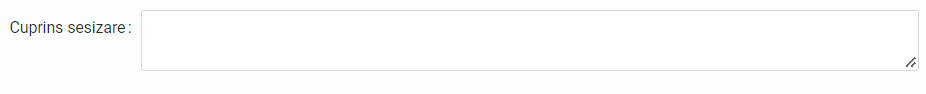

**LargeTextBox** mosteneste **FormControl**
<table>
    <tr>
        <th>Denumire</th>
        <th>Tip</th>
        <th>Observatii</th>
        <th>Valoare implicita</th>
    </tr>
    <tr>
        <td>autoSize</td>
        <td>boolean!</td>
        <td>Campul se redimensioneaza automat pe inaltime in functie de dimensiunile textului</td>
        <td>false</td>
    </tr>
    <tr>
        <td>minRows</td>
        <td>intreg</td>
        <td>Numarul minim de randuri afisate pe inaltime.</td>
        <td>null</td>
    </tr>
    <tr>
        <td>maxRows</td>
        <td>intreg</td>
        <td>Numarul maxim de randuri afisate pe inaltime.</td>
        <td>null</td>
    </tr>
</table>

## 2.3. PasswordBox
Camp de introducere parole. Valorile tastate vor fi afisate mascat.

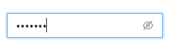

**PasswordBox** mosteneste **TextBox**
<table>
    <tr>
        <th>Denumire</th>
        <th>Tip</th>
        <th>Observatii</th>
        <th>Valoare implicita</th>
    </tr>
</table>

## 2.4. NumberInput
Camp de introducere valori numerice.

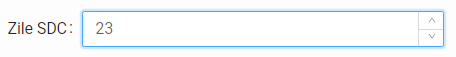

**NumberInput** mosteneste **FormControl**
<table>
    <tr>
        <th>Denumire</th>
        <th>Tip</th>
        <th>Observatii</th>
        <th>Valoare implicita</th>
    </tr>
    <tr>
        <td>value</td>
        <td>real</td>
        <td>Valoarea afisata in camp.</td>
        <td></td>
    </tr>
    <tr>
        <td>min</td>
        <td>real</td>
        <td>Valoarea minima ce poate fi introdusa in camp.</td>
        <td>null</td>
    </tr>
    <tr>
        <td>max</td>
        <td>real</td>
        <td>Valoarea maxima ce poate fi introdusa in camp.</td>
        <td>null</td>
    </tr>
    <tr>
        <td>precision</td>
        <td>intreg</td>
        <td>Numarul maxim de zecimale ce poate fi introdus.</td>
        <td>null</td>
    </tr>
    <tr>
        <td>step</td>
        <td>real!</td>
        <td>Pasul cu care se incrementeaza/decrementeaza valoarea campului atunci cand se folosesc sagetelele din dreapta campului.</td>
        <td>1</td>
    </tr>
</table>

## 2.5. CheckBox
Camp de bifa.

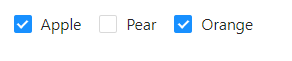

**CheckBox** mosteneste **FormControl**
<table>
    <tr>
        <th>Denumire</th>
        <th>Tip</th>
        <th>Observatii</th>
        <th>Valoare implicita</th>
    </tr>
    <tr>
        <td>value</td>
        <td>boolean!</td>
        <td>Daca value este true atunci CheckBox-ul va fi afisat ca fiind bifat, altfel va fi afisat nebifat.</td>
        <td>false</td>
    </tr>
</table>

## 2.6. Radio
Control cu bifare multipla in care o singura optiune poate fi aleasa la oricare moment dat.

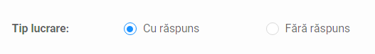

**Radio** mosteneste **FormControl**
<table>
    <tr>
        <th>Denumire</th>
        <th>Tip</th>
        <th>Observatii</th>
        <th>Valoare implicita</th>
    </tr>
    <tr>
        <td>value</td>
        <td>any</td>
        <td>Valoarea optiunii bifate.</td>
        <td>null</td>
    </tr>
    <tr>
        <td>options</td>
        <td>RadioOption[]</td>
        <td>Optiunile afisate.</td>
        <td>[]</td>
    </tr>
</table>

**RadioOption** mosteneste **Control**
<table>
    <tr>
        <th>Denumire</th>
        <th>Tip</th>
        <th>Observatii</th>
        <th>Valoare implicita</th>
    </tr>
    <tr>
        <td>label</td>
        <td>text</td>
        <td>Eticheta afisata, daca este cazul.</td>
        <td>null</td>
    </tr>
    <tr>
        <td>value</td>
        <td>any</td>
        <td>Valoarea optiunii daca este bifata.</td>
        <td>null</td>
    </tr>
</table>

## 2.7. DatePicker
Camp de selectie / tastare date calendaristice.

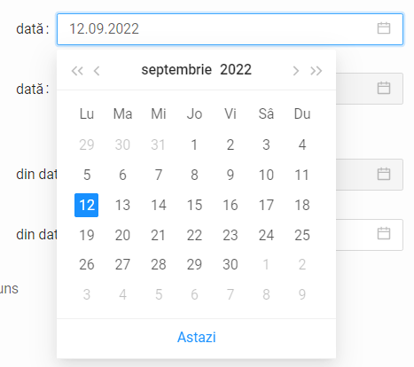

**DatePicker** mosteneste **FormControl**
<table>
    <tr>
        <th>Denumire</th>
        <th>Tip</th>
        <th>Observatii</th>
        <th>Valoare implicita</th>
    </tr>
    <tr>
        <td>value</td>
        <td>date</td>
        <td>Data afisata in camp.</td>
        <td>null</td>
    </tr>
    <tr>
        <td>format</td>
        <td>string</td>
        <td>Formatul in care se afiseaza data.</td>
        <td>"zz.ll.aaaa"</td>
    </tr>
</table>

## 2.8. Select
Camp de tip lista de selectie.

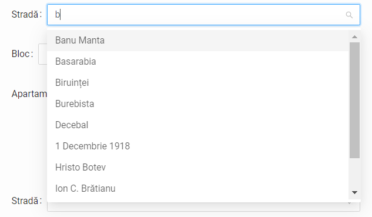

**Select** mosteneste **FormControl**
<table>
    <tr>
        <th>Denumire</th>
        <th>Tip</th>
        <th>Observatii</th>
        <th>Valoare implicita</th>
    </tr>
    <tr>
        <td>value</td>
        <td>any</td>
        <td>Valoarea optiunii bifate.</td>
        <td>null</td>
    </tr>
    <tr>
        <td>options</td>
        <td>SelectOption[]</td>
        <td>Optiunile afisate in lista de selectie.</td>
        <td>[]</td>
    </tr>
</table>

**SelectOption**
<table>
    <tr>
        <th>Denumire</th>
        <th>Tip</th>
        <th>Observatii</th>
        <th>Valoare implicita</th>
    </tr>
    <tr>
        <td>label</td>
        <td>text!</td>
        <td>Valoarea afisata - de exemplu denumirea din nomenclator.</td>
        <td></td>
    </tr>
    <tr>
        <td>value</td>
        <td>any</td>
        <td>Valoarea selectata - de regula un id</td>
        <td>null</td>
    </tr>
    <tr>
        <td>disabled</td>
        <td>boolean!</td>
        <td>Daca valoarea este true, optiunea va fi afisata in lista de selectie dar nu va putea fi selectata.</td>
        <td>false</td>
    </tr>
</table>

## 2.9. Slider
Camp de tip slider. Valoarea selectata este de tip real.

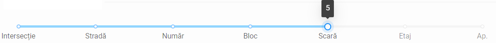

**Slider** mosteneste **FormControl**
<table>
    <tr>
        <th>Denumire</th>
        <th>Tip</th>
        <th>Observatii</th>
        <th>Valoare implicita</th>
    </tr>
    <tr>
        <td>value</td>
        <td>real!</td>
        <td>Valoarea selectata.</td>
        <td></td>
    </tr>
    <tr>
        <td>min</td>
        <td>real!</td>
        <td>Valoarea minima ce poate fi selectata.</td>
        <td>0</td>
    </tr>
    <tr>
        <td>max</td>
        <td>real!</td>
        <td>Valoarea maxima ce poate fi selectata.</td>
        <td>100</td>
    </tr>
    <tr>
        <td>step</td>
        <td>real!</td>
        <td>Pasul cu care se incrementeaza/decrementeaza valoarea campului atunci cand se trage de slider. Valoarea trebuie sa fie > 0 si sa fie divizibila cu (max - min).</td>
        <td>1</td>
    </tr>
    <tr>
        <td>vertical</td>
        <td>boolean!</td>
        <td>Daca este true, slider-ul va fi orientat vertical. Altfel va fi orientat orizontal.</td>
        <td>false</td>
    </tr>
    <tr>
        <td>options</td>
        <td>SliderOption[]</td>
        <td>Label-urile care vor fi afisate pentru fiecare pas, daca este cazul.</td>
        <td>null</td>
    </tr>
</table>

## 2.10. Button
Buton. La apasarea sa se va rula functia specificata pe proprietatea onClick.

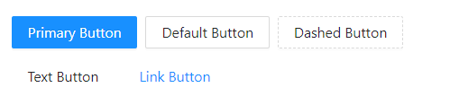
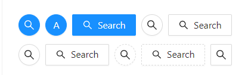
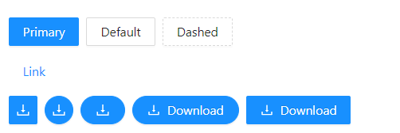
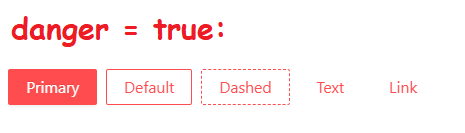

**Button** mosteneste **Control**
<table>
    <tr>
        <th>Denumire</th>
        <th>Tip</th>
        <th>Observatii</th>
        <th>Valoare implicita</th>
    </tr>
    <tr>
        <td>label</td>
        <td>text</td>
        <td>Textul afisat pe buton, daca este cazul.</td>
        <td>null</td>
    </tr>
    <tr>
        <td>onClick</td>
        <td>Function</td>
        <td>Functia declansata la apasarea butonului.</td>
        <td>null</td>
    </tr>
    <tr>
        <td>shape</td>
        <td>text</td>
        <td>Defineste forma butonului. Valori posibile: "default" | "circle" | "round".</td>
        <td>"default"</td>
    </tr>
    <tr>
        <td>type</td>
        <td>text</td>
        <td>Defineste stilul butonului. Valori posibile: "default" | "primary" | "ghost" | "dashed" | "link" | "text".</td>
        <td>"default"</td>
    </tr>
    <tr>
        <td>danger</td>
        <td>boolean!</td>
        <td>Marcheaza un buton ce trebuie apasat cu atentie. Daca este true, butonul va fi colorat rosu.</td>
        <td>false</td>
    </tr>
    <tr>
        <td>icon</td>
        <td>text</td>
        <td>Defineste iconita butonului, daca e cazul.</td>
        <td>null</td>
    </tr>
</table>

# 3. Elemente de afisare

## 3.1. Label
Camp de afisare de texte.

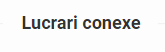

**Label** mosteneste **UIElement**
<table>
    <tr>
        <th>Denumire</th>
        <th>Tip</th>
        <th>Observatii</th>
        <th>Valoare implicita</th>
    </tr>
    <tr>
        <td>label</td>
        <td>text</td>
        <td>Valoarea afisata.</td>
        <td></td>
    </tr>
    <tr>
        <td>bold</td>
        <td>boolean!</td>
        <td>Label-ul este bold-uit</td>
        <td>false</td>
    </tr>
    <tr>
        <td>italic</td>
        <td>boolean!</td>
        <td>Label-ul este in format italic</td>
        <td>false</td>
    </tr>
    <tr>
        <td>underline</td>
        <td>boolean!</td>
        <td>Label-ul este subliniat</td>
        <td>false</td>
    </tr>
</table>

## 3.2. Modal
Ferestre pop-up. Afisarea / ascunderea se controleaza prin proprietatea `hidden`.

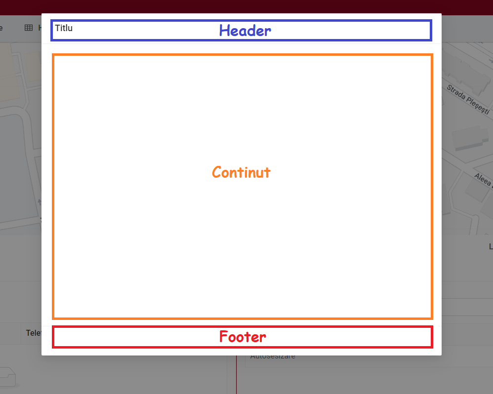

**Modal**\<TipItem\> mosteneste **UIElement**
<table>
    <tr>
        <th>Denumire</th>
        <th>Tip</th>
        <th>Observatii</th>
        <th>Valoare implicita</th>
    </tr>
    <tr>
        <td>title</td>
        <td>text</td>
        <td>Titlul ferestrei, daca este cazul.</td>
        <td>null</td>
    </tr>
    <tr>
        <td>item</td>
        <td>TipItem</td>
        <td>Obiectul incarcat in fereastra.</td>
        <td>null</td>
    </tr>
</table>

# 4. Table
Element de afisare date si controale sub forma tabelara.

**Table**\<TipRand\> mosteneste **UIElement**
<table>
    <tr>
        <th>Denumire</th>
        <th>Tip</th>
        <th>Observatii</th>
        <th>Valoare implicita</th>
    </tr>
    <tr>
        <td>title</td>
        <td>text</td>
        <td>Titlul tabelului, daca este cazul.</td>
        <td>null</td>
    </tr>
    <tr>
        <td>columns</td>
        <td>(TableColumn | TableColumnGroup)[]</td>
        <td>Coloanele tabelului.</td>
        <td></td>
    </tr>
    <tr>
        <td>rows</td>
        <td>TipRand[]</td>
        <td>Elementele setului de date din tabel.</td>
        <td></td>
    </tr>
    <tr>
        <td>pagination</td>
        <td>boolean!</td>
        <td>Daca este true, tabelul are paginare.</td>
        <td>true</td>
    </tr>
</table>

**TableColumn** mosteneste **UIElement**
<table>
    <tr>
        <th>Denumire</th>
        <th>Tip</th>
        <th>Observatii</th>
        <th>Valoare implicita</th>
    </tr>
    <tr>
        <td>title</td>
        <td>text</td>
        <td>Titlul coloanei, daca este cazul.</td>
        <td>null</td>
    </tr>
    <tr>
        <td>name</td>
        <td>text</td>
        <td>Denumirea proprietatii din rand pentru mapare automata.</td>
        <td>null</td>
    </tr>
    <tr>
        <td>value</td>
        <td>functie (row: TipRand, index: intreg): UIElement</td>
        <td>Functie ce determina elementul de interfata afisat in celula randului cu indexul `index`.</td>
        <td>null</td>
    </tr>
    <tr>
        <td>align</td>
        <td>text</td>
        <td>Alinierea elementelor din coloane. Valori posibile: "left" | "right" | "center".</td>
        <td>"left"</td>
    </tr>
</table>

**TableColumnGroup** mosteneste **UIElement**
<table>
    <tr>
        <th>Denumire</th>
        <th>Tip</th>
        <th>Observatii</th>
        <th>Valoare implicita</th>
    </tr>
    <tr>
        <td>title</td>
        <td>text</td>
        <td>Titlul grupului de coloane, daca este cazul.</td>
        <td>null</td>
    </tr>
    <tr>
        <td>columns</td>
        <td>(TableColumn | TableColumnGroup)[]</td>
        <td>Coloanele subordonate grupului.</td>
        <td></td>
    </tr>
</table>

Putem declara o tabela sub forma tabelara simplificata astfel:

**\<DenumireTipTabela\>** mosteneste **Table**\<\<TipRand\>\>
<table>
    <tr>
        <th>Proprietate</th>
        <th>Titlu</th>
        <th>Tip control</th>
        <th>Observatii</th>
    </tr>
    <tr>
        <td>&ltproprietateColoana1&gt</td>
        <td>&ltTitlu Coloana 1&gt</td>
        <td>&lttipControl1&gt</td>
        <td>&ltobservatiiColoana1&gt</td>
    </tr>
    <tr>
        <td>&ltproprietateColoana2&gt</td>
        <td>&ltTitlu Coloana 2&gt</td>
        <td>&lttipControl2&gt</td>
        <td>&ltobservatiiColoana2&gt</td>
    </tr>
    <tr>
        <td>...</td>
        <td>...</td>
        <td>...</td>
        <td>...</td>
    </tr>
    <tr>
        <td></td>
        <td>&ltTitlu grupare coloane K&gt</td>
        <td>&ltTipGrupareColoaneK&gt</td>
        <td>&ltobservatiiGrupareColoaneK&gt</td>
    </tr>
    <tr>
        <td>...</td>
        <td>...</td>
        <td>...</td>
        <td>...</td>
    </tr>
    <tr>
        <td>&ltproprietateColoanaN&gt</td>
        <td>&ltTitlu Coloana N&gt</td>
        <td>&lttipControlN&gt</td>
        <td>&ltobservatiiColoanaN&gt</td>
    </tr>
</table>

**\<DenumireTipGrupareColoane\>** mosteneste **TableColumnGroup**
<table>
    <tr>
        <th>Proprietate</th>
        <th>Titlu</th>
        <th>Tip control</th>
        <th>Observatii</th>
    </tr>
    <tr>
        <td>&ltproprietateColoana1&gt</td>
        <td>&ltTitlu Coloana 1&gt</td>
        <td>&lttipControl1&gt</td>
        <td>&ltobservatiiColoana1&gt</td>
    </tr>
    <tr>
        <td>&ltproprietateColoana2&gt</td>
        <td>&ltTitlu Coloana 2&gt</td>
        <td>&lttipControl2&gt</td>
        <td>&ltobservatiiColoana2&gt</td>
    </tr>
    <tr>
        <td>...</td>
        <td>...</td>
        <td>...</td>
        <td>...</td>
    </tr>
    <tr>
        <td></td>
        <td>&ltTitlu grupare coloane K&gt</td>
        <td>&ltTipGrupareColoaneK&gt</td>
        <td>&ltobservatiiGrupareColoaneK&gt</td>
    </tr>
    <tr>
        <td>...</td>
        <td>...</td>
        <td>...</td>
        <td>...</td>
    </tr>
    <tr>
        <td>&ltproprietateColoanaN&gt</td>
        <td>&ltTitlu Coloana N&gt</td>
        <td>&lttipControlN&gt</td>
        <td>&ltobservatiiColoanaN&gt</td>
    </tr>
</table>

## 4.1. Exemplu

**Sesizare**
|Proprietate|Tip|Observatii|
|---|---|---|
|id|id!||
|nrDocument|text||
|dataDocument|date||
|stare|text||
|nume|text||
|prenume|text||
|cnp|text||

**TabelaDocumente** mosteneste **Table**\<Sesizare\>
<table>
    <tr>
        <th>Proprietate</th>
        <th>Titlu</th>
        <th>Tip Control</th>
        <th>Observatii</th>
    </tr>
    <tr>
        <td></td>
        <td>Document</td>
        <td>TabelaDocumente_Document</td>
        <td></td>
    </tr>
    <tr>
        <td>nume</td>
        <td>Nume</td>
        <td>Label</td>
        <td></td>
    </tr>
    <tr>
        <td>prenume</td>
        <td>Prenume</td>
        <td>Label</td>
        <td></td>
    </tr>
    <tr>
        <td>cnp</td>
        <td>CNP</td>
        <td>Label</td>
        <td></td>
    </tr>
    <tr>
        <td></td>
        <td></td>
        <td>Button</td>
        <td>
            <pre>
fie buton: Button = butonul din rand
fie rand: Sesizare = randul curent
&nbsp;
buton.label = "Editează"
&nbsp;
daca rand.stare = "finalizat"
    buton.disabled = true
&nbsp;
la apasarea butonului se deschide sesizarea cu id = rand.id
            </pre>
        </td>
    </tr>
</table>

**TabelaDocumente_Document** mosteneste **TableColumnGroup**
<table>
    <tr>
        <th>Proprietate</th>
        <th>Titlu</th>
        <th>Tip Control</th>
        <th>Observatii</th>
    </tr>
    <tr>
        <td>nrDocument</td>
        <td>Număr document</td>
        <td>Label</td>
        <td></td>
    </tr>
    <tr>
        <td>dataDocument</td>
        <td>Dată document</td>
        <td>Label</td>
        <td></td>
    </tr>
</table>

# 5. Elemente functionale
//TODO